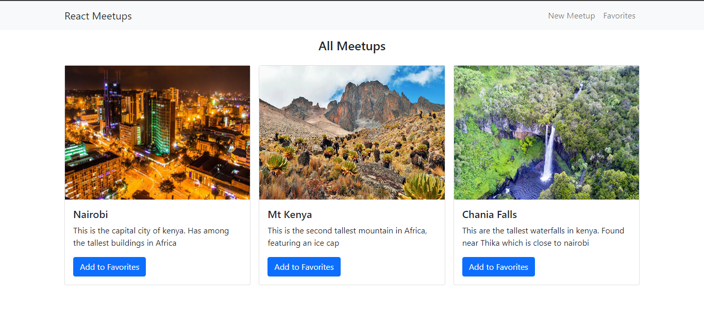

# React meetups

This is a react project with Bootstrap 5 for seeing meetups at various places
 Displays: 
title 
image 
decription 

To install requirements enter into directory in cmd and type

<i>npm install</i>

<h2>Why make this?</h2>

To understand react and have some fun with code

